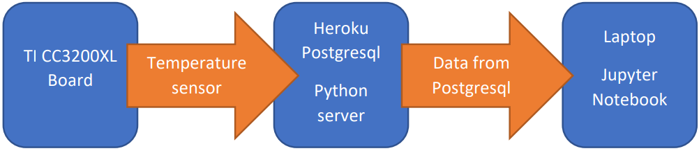
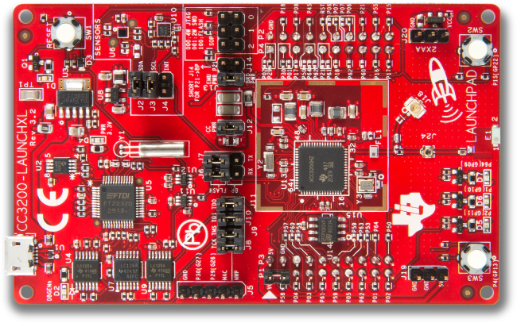

# Smart Systems Assignment 1

Assignment 1 of the Smart Systems course lectured by [Vincent Claes](https://www.linkedin.com/in/vincentclaes/) @ [PXL University College](https://www.pxl.be).
The goal of this assignment is to write firmware for the [SimpleLink Wi-Fi CC3200 LaunchPad](http://www.ti.com/tool/CC3200-LAUNCHXL) that collects
and uploads the data it gathers from its temperature sensor. 
Using the collected data the goal is to make a prediction of temperatures. 
This prediction is made in Jupyter Notebooks using the Python scripting language.
A flask server backend is provided on an heroku server together with an heroku PostgreSQL.

## Source Roadmap

```
server    directory containing all the server code
CC3200    directory containing the CCS project
Python    directory containing the Jupyter Notebook
misc      miscellaneous
```

## System Overview

<p align="center"></p>

## Project Goals

<details>
<summary>Click to expand the project goals</summary>


* For this project you have to plug in your CC3200XL board and upload temperature values to
  the Python-Heroku server-system, be sure to have a large number of temperature values
  available, be sure to place your module in the same room for some time for it to be able to collect usable data… 
  
  <p align="center"></p>
  
* Use the Heroku-Postgresql-DB system as a server system
	<p align="center"></p>

* Develop a Jupyter Notebook application with the following requirements
    - Connect to the Postgresql Database on the remote Heroku server
    - Make Data visualizations of the temperature values that are in the database on the 
      server (be sure to only use values from 1 place)
    - Do some basic EDA (Exploratory Data Analysis on the data)
    - Our temperature values are typically time series data, in machine learning projects
      they often use “Seasonal-Arima” forecasting for predicting new values for timeseries
      (you may search for examples like forecasting stock prices,…). You have to predict new
      temperature values for the next hour and day using a Seasonal-Arima forecasting
      model.
	  
	  <p align="center"></p>

</details>

## Built With

* [Python](https://www.python.org/) - The programming language used
* [Flask](http://flask.pocoo.org/) - The web framework used
> See server/requirements.txt for a full list of used python modules to run the server.
* [Heroku](https://www.heroku.com/home) - The deployment server
* [SimpleLink Wi-Fi CC3200 LaunchPad](http://www.ti.com/tool/CC3200-LAUNCHXL) - The development board used

## Authors

* *Vincent Claes*    - Lecturer - [LinkedIn](https://www.linkedin.com/in/vincentclaes/)
* *Jeffrey Gorissen* - Student  - [LinkedIn](https://www.linkedin.com/in/jeffrey-gorissen-6120a2142/)
* *Bryan Honof*      - Student  - [LinkedIn](https://www.linkedin.com/in/bryan-honof/)

<p align="left"></p>

## License

This project is licensed under the MIT License - see the [LICENSE.md](LICENSE.md) file for details.

## Acknowledgments

* Hat tip to anyone whose code was used
* Inspiration

